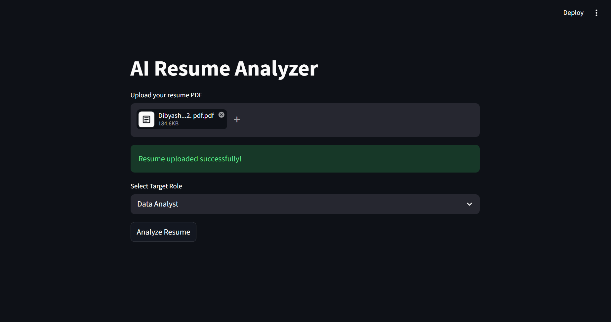
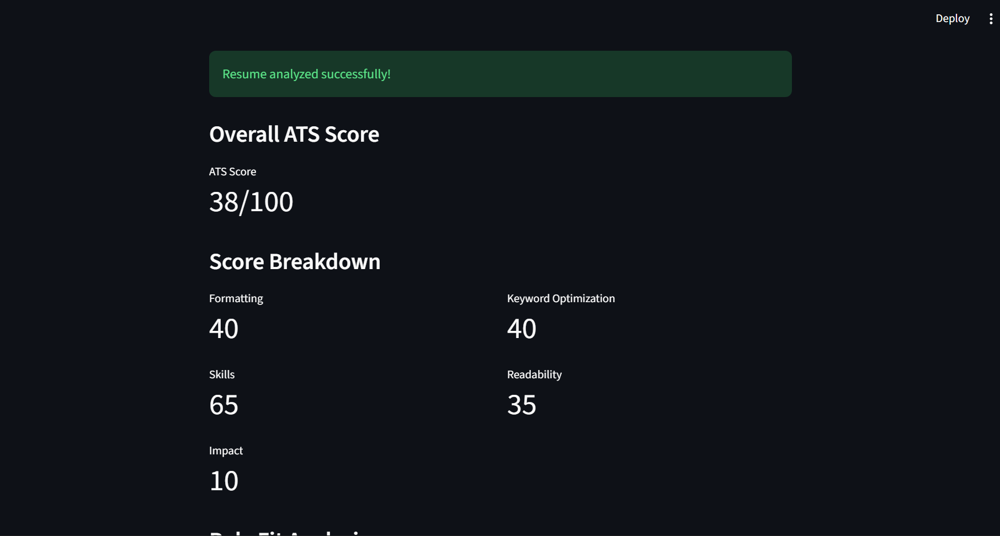
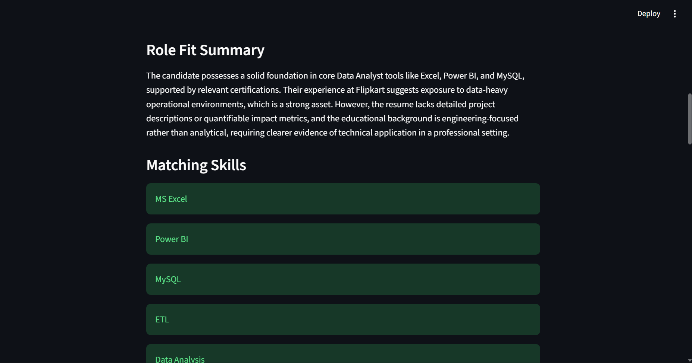
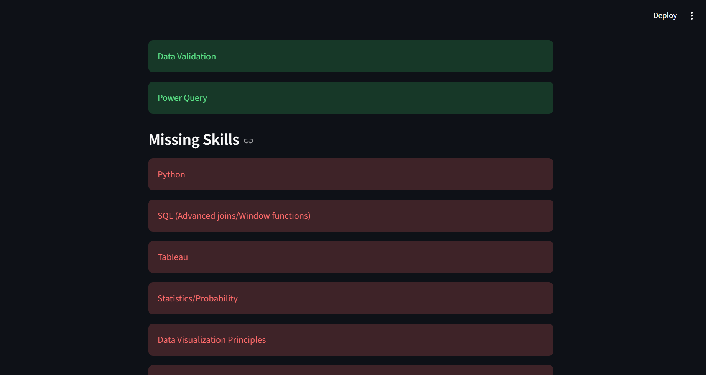
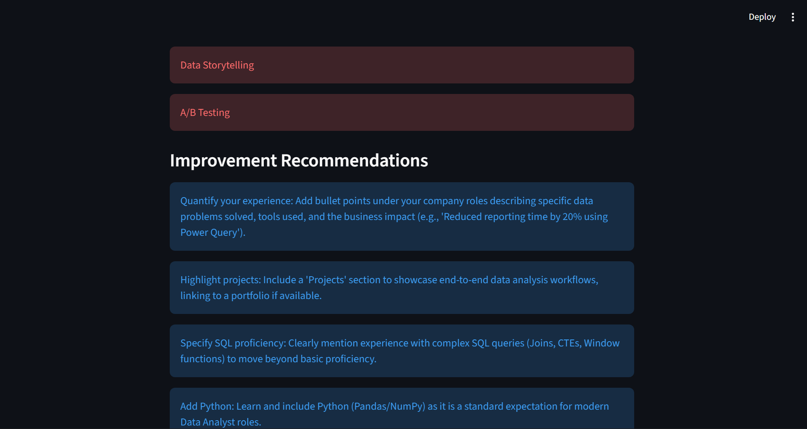
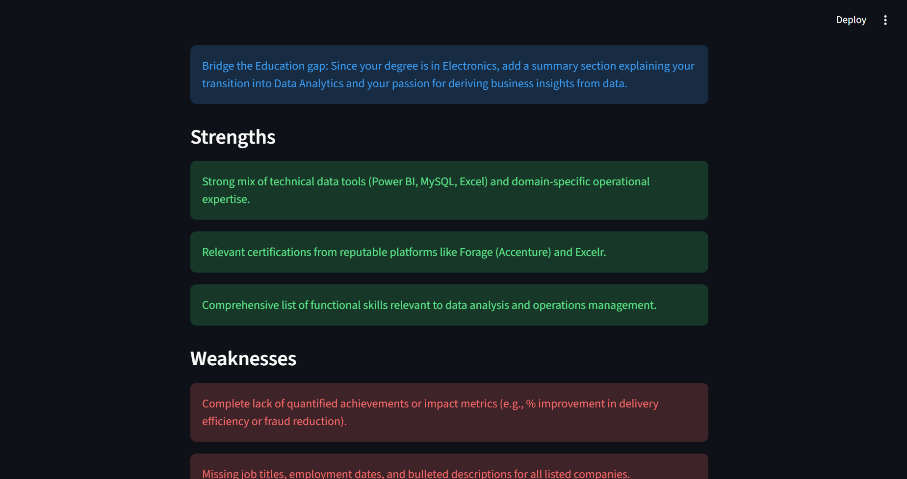
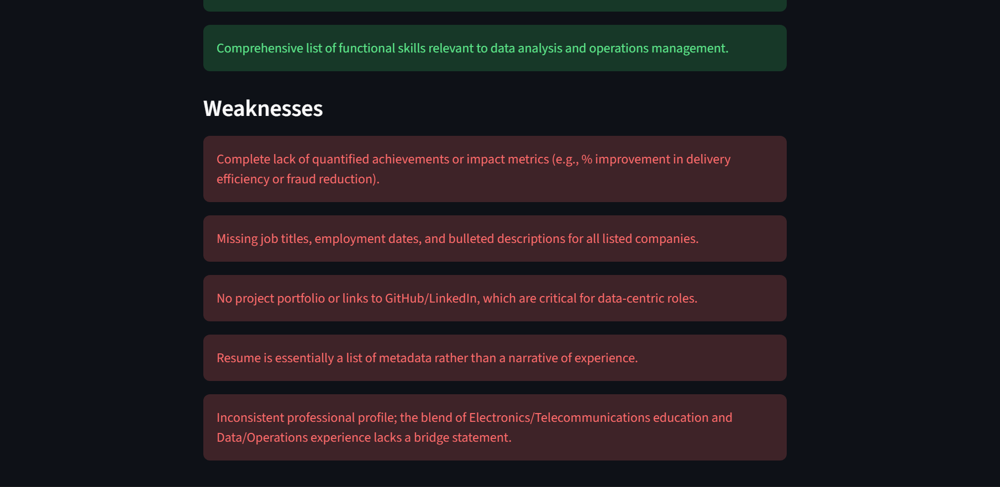

# AI Resume Analyzer

An AI-powered Resume Analyzer built using FastAPI, Streamlit, and Google Gemini AI.

Upload a resume PDF and get:
- ATS Score Analysis
- Resume Strengths & Weaknesses
- Role Fit Evaluation
- Missing Skills Detection
- AI-powered Resume Suggestions
- Structured Resume Extraction

---

# Features

- Resume PDF Upload
- PDF Text Extraction
- Resume Text Cleaning Pipeline
- Structured Resume Data Extraction
- ATS Score Evaluation
- Score Breakdown Dashboard
- Role Fit Analysis
- Matching Skills Detection
- Missing Skills Detection
- AI Improvement Suggestions
- FastAPI Backend
- Streamlit Frontend Dashboard
- Modular AI Pipeline Architecture

---

# Tech Stack

## Backend
- FastAPI
- Python
- Pydantic
- Google Gemini API

## Frontend
- Streamlit

## AI / NLP
- Prompt Engineering
- Structured AI Outputs
- Resume Information Extraction
- AI Evaluation Pipelines

---

# Project Architecture

```text
Resume PDF
    ↓
PDF Parser
    ↓
Text Extraction
    ↓
Text Cleaning
    ↓
Structured Resume Extraction (Gemini)
    ↓
Pydantic Validation
    ↓
ATS Evaluation Engine
    ↓
Role Fit Evaluation Engine
    ↓
Frontend Dashboard
```

---

# Folder Structure

```text
RESUME-ANALYZER
│
├── backend
│   ├── app
│   │   ├── models
│   │   │   ├── ats_model.py
│   │   │   ├── resume_model.py
│   │   │   └── role_fit_model.py
│   │   │
│   │   ├── parsers
│   │   │   └── pdf_parser.py
│   │   │
│   │   ├── prompts
│   │   │   ├── ats_prompt.py
│   │   │   ├── role_fit_prompt.py
│   │   │   └── structure_prompt.py
│   │   │
│   │   ├── routes
│   │   │   └── resume.py
│   │   │
│   │   ├── services
│   │   │   ├── ats_service.py
│   │   │   ├── gemini_service.py
│   │   │   ├── resume_service.py
│   │   │   └── role_fit_service.py
│   │   │
│   │   ├── utils
│   │   │   ├── json_parser.py
│   │   │   └── text_cleaner.py
│   │   │
│   │   └── main.py
│   │
│   └── uploads
│
├── frontend
│   └── streamlit_app.py
│
├── uploads
├── venv
├── .gitignore
├── README.md
└── requirements.txt
```

---

# Installation

## 1. Clone Repository

```bash
git clone https://github.com/decoded15/resume-analyzer.git
cd resume-analyzer
```

---

## 2. Create Virtual Environment

```bash
python -m venv venv
```

### Activate Environment

#### Windows
```bash
venv\Scripts\activate
```

#### Mac/Linux
```bash
source venv/bin/activate
```

---

## 3. Install Dependencies

```bash
pip install -r requirements.txt
```

---

## 4. Add Gemini API Key

Create a `.env` file inside `backend/`

```env
GEMINI_API_KEY=your_api_key_here
```

---

# Running The Project

## Start FastAPI Backend

```bash
uvicorn app.main:app --reload
```

Backend runs on:

```text
http://127.0.0.1:8000
```

---

## Start Streamlit Frontend

```bash
streamlit run streamlit_app.py
```

Frontend runs on:

```text
http://localhost:8501
```

---

# API Workflow

```text
Frontend Upload
      ↓
FastAPI Backend
      ↓
Resume Extraction
      ↓
Gemini AI Processing
      ↓
Structured JSON Output
      ↓
ATS Evaluation
      ↓
Role Fit Analysis
      ↓
Frontend Dashboard Rendering
```

---

# Screenshots

## Upload Resume


---

## ATS Dashboard


---

## Role Fit Analysis






---

# Key AI Engineering Concepts Learned

- PDF Parsing
- AI Orchestration Pipelines
- Structured AI Outputs
- Prompt Engineering
- Pydantic Validation
- Resume Information Extraction
- AI Evaluation Systems
- Backend Architecture
- Frontend ↔ Backend Communication
- Multi-stage AI Pipelines
- AI Reliability & Validation

---

# Future Improvements

- Job Description Matching
- Resume Bullet Rewriter
- Resume Completeness Checker
- AI Resume Rewriting
- Cover Letter Generator
- Authentication System
- Database Integration
- Deployment

---

# Author

Built by Dibyansh (decoded15)